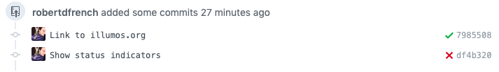

# Zoolander CI
Zoolander is a minimal CI environment for the [illumos][1] operating system. It
provides a single VM which manages CI for a single GitHub project, namely itself.

Zoolander's job is to provide the little green checkmarks next to commits which
pass their tests, and to add a little red X next to any commit which fails its
tests:



Feel free to browse through this repo's
[prior commits](https://github.com/robertdfrench/zoolander-ci/commits/master)
to see this in action. Per normal GitHub conventions, clicking on either the
checkmark or an X next to a commit will provide you with a "Details" link that
will show you the console output for that commit's CI run.

### Features
* Updates commit status when builds start, pass, or fail
* Self-deploying. Simply `make deploy` (with proper AWS credentials)
* Dogfood capable! (Zoolander CI is tested via a Zoolander CI instance!)
* Runs CI jobs as an unprivileged user (aptly named `derek`)
* **Plaintext browser ui!** Who needs Javascript when you have Ctrl-R?
```console
 #######                                                              #####  ### 
      #   ####   ####  #        ##   #    # #####  ###### #####      #     #  #  
     #   #    # #    # #       #  #  ##   # #    # #      #    #     #        #  
    #    #    # #    # #      #    # # #  # #    # #####  #    #     #        #  
   #     #    # #    # #      ###### #  # # #    # #      #####      #        #  
  #      #    # #    # #      #    # #   ## #    # #      #   #      #     #  #  
 #######  ####   ####  ###### #    # #    # #####  ###### #    #      #####  ### 

+------------------------------------------------------------------------------+
|            Refresh your browser to see the latest build output               |
+------------------------------------------------------------------------------+

From https://github.com/robertdfrench/zoolander-ci
   a83e22a..c0140fc  thin-line-banner -> origin/thin-line-banner
OmniOS 5.11	omnios-r151030-632fca26eb	May 2019
/opt/ooce/bin/cargo test

running 11 tests
test http_document::tests::new_has_content_type ... ok
test http_document::tests::headers_is_a_sorted_iterator ... ok
test http_document::tests::return_text_plain ... ok
test http_document::tests::sorted_headers ... ok
test integration::can_read_empty_log ... ok
test integration::can_read_log ... ok
test pathify::tests::normal ... ok
test pathify::tests::short ... ok
test push_event::tests::accept_a_push_event ... ok
test push_event::tests::real_push_event ... ok
test integration::spawns_make ... ok

test result: ok. 11 passed; 0 failed; 0 ignored; 0 measured; 0 filtered out
```

### Limitations
Due to a handful of hadrcoded paths, Zoolander CI can currently *only test
itself*. See [Milestone 2](https://github.com/robertdfrench/zoolander-ci/milestone/2)
for more information about what work remains to make Zoolander easy for others
to use.

Zoolander also has some woeful security problems. Webhooks are not delivered
over TLS, and the application itself runs as root (although the CI jobs are
executed as an unprivileged user). See [#14](https://github.com/robertdfrench/zoolander-ci/issues/14), [#12](https://github.com/robertdfrench/zoolander-ci/issues/12), and [#26](https://github.com/robertdfrench/zoolander-ci/issues/26) for more information
about potential solutions to these problems.

### Getting Started
This repository is capable of bootstrapping and deploying itself, assuming you
have valid AWS credentials and sufficient privileges to create and manage EC2
instance, images, and security groups. You will also need a github account.

* [Create a GitHub API Token](https://github.com/settings/tokens/new)
  * You only need the `repo:status` permission
* [Configure your AWS Credentials file](https://docs.aws.amazon.com/cli/latest/userguide/cli-configure-files.html)
* Install:
  * [Packer](https://www.packer.io/downloads.html)
  * [Terraform](https://www.terraform.io/downloads.html)
  * [jq](https://stedolan.github.io/jq/)
  * [GNU Make](https://www.gnu.org/software/make/) (probably already installed).

Each [Makefile](Makefile) in this repo is self-documenting. Just run `make help`
in any directory to describe the available tasks.

#### Configuring Webhooks
Once you have deployed a zoolander instance, you will need to give it your API
token, and point your webhooks to it. To deploy your token (or rotate your token
in the event that it needs to change) just run `make rotate`. You will be
prompted to paste in your GitHub API token, and Make will then install it on
your zoolander instance.

Finally, to configure the webhook for your repository, go to `Settings >
Webhooks > Add webhook`. The payload URL will look like `http://X.X.X.X/zoolander/webhook`
where `X.X.X.X` is your Zoolander instance ip. Set the content-type to json, and
then click "Add Webhook".

[1]: https://www.illumos.org
